```mermaid
flowchart TB
    %% ══════════════════════════════════════════════════════
    %% POLYCLAW — MESSAGING & CHANNEL ARCHITECTURE
    %% ══════════════════════════════════════════════════════

    %% ── CHANNEL SWIMLANES (top row) ────────────────────
    subgraph bflane["🔗 Bot Framework Channel  (Azure Bot Service · REST)"]
        direction LR
        UBF(["👤 Teams · Slack · Telegram via Azure"])
        BF["Bot(ActivityHandler)\non_message_activity()"]
        ABF{"Azure Auth\n+ Whitelist"}
        HPBF{{"🔄 Pending\nHITL?"}}
        CMD_BF["⌨️ CommandDispatcher\n/new /status /model /skills …"]
        MP["⚙️ MessageProcessor\nprocess(ref, prompt, ch)\nBackground task — avoids 15s timeout\nTyping indicator loop 3s"]
        UBF -->|"REST POST /api/messages"| BF --> ABF --> HPBF
        HPBF -->|"no — cmd?"| CMD_BF
        HPBF -->|"yes → resolve"| MP
        CMD_BF -->|"not handled"| MP
    end

    subgraph tglane["📨 Telegram Native Channel  (HTTP Long-Poll · no public URL needed)"]
        direction LR
        UTG(["👤 Telegram Direct"])
        TG["TelegramPollingChannel\n_poll_loop() → _handle_update()\ngetUpdates timeout=30s"]
        ATG{"Telegram\nWhitelist"}
        HPTG{{"🔄 Pending\nHITL?"}}
        CMD_TG["⌨️ CommandDispatcher\n/new /status /model /skills …"]
        TGR["⚙️ _run_turn(chat_id, text)\nInline async · sendChatAction typing"]
        UTG -->|"getUpdates long-poll"| TG --> ATG --> HPTG
        HPTG -->|"no — cmd?"| CMD_TG
        HPTG -->|"yes → resolve"| TGR
        CMD_TG -->|"not handled"| TGR
    end

    subgraph wslane["🌐 WebSocket Chat Channel  (/api/chat/ws · Real-time)"]
        direction LR
        UWS(["👤 Web / Admin UI"])
        WS["ChatHandler\nhandle() WebSocket"]
        CMD_WS["⌨️ CommandDispatcher\n/new /status /model /skills …"]
        WSP["⚙️ _send_prompt(ws, data)\nStreams on_delta · on_event (tools)"]
        UWS -->|"WS upgrade"| WS --> CMD_WS -->|"not handled"| WSP
    end

    %% ── SHARED AGENT CORE ──────────────────────────────
    subgraph agentcore["④ Agent Core"]
        direction LR
        AGT["🤖 Agent\nagent.send(prompt)\n• on_delta — text chunks\n• on_event — tool events\n• pre-tool → HitlInterceptor"]

        subgraph hitlblock["🛡️ HitlInterceptor  —  on_pre_tool_use()  →  allow · deny"]
            direction LR
            HITL["Prompt Shield\nfilter\nPer-turn\nbind/unbind"]
            HC1["💬 Chat WS\nemit(approval_request)\nwait Future 300s"]
            HC2["🤖 Bot Reply\nsend confirm\nwait 'y'"]
            HC3["📞 Phone\nPhoneVerifier\n.request_verification()"]
            HC4["🧠 AITL\nAitlReviewer\n.review()"]
            HITL --> HC1 & HC2 & HC3 & HC4 -->|"allow/deny"| HITL
        end

        AGT <-->|"pre-tool · decision"| HITL
    end

    %% ── STATE & PERSISTENCE ────────────────────────────
    subgraph statelayer["⑤ State & Persistence"]
        direction LR
        SS["📁 SessionStore\n~/.polyclaw/sessions/*.json\nrole · content · timestamp · channel · tool_calls"]
        CRS["📋 ConversationReferenceStore\nconv_refs.json  Key: channel_id:user_id\nStores refs for proactive messaging"]
        MEM["🧠 MemoryFormation\nDaily logs · topic notes\nLong-term context"]
    end

    %% ── BACKGROUND SERVICES ────────────────────────────
    subgraph bgsvc["⑥ Background Services"]
        direction LR
        PDL["⏰ ProactiveDeliveryLoop  60s\n• Deliver scheduled messages\n• Auto-generate via LLM when user idle > 1h\n• Daily limit · preferred time window"]
        CQ["🃏 CardQueue  thread-safe\nAdaptive Cards · Hero Cards\ndrain() on each response send"]
    end

    %% ── OUTPUT / DELIVERY ──────────────────────────────
    subgraph outlayer["⑦ Output & Delivery"]
        direction LR
        FMT["🎨 Formatting\nmarkdown_to_telegram()\nstrip_markdown()\nChannel-aware text"]
        CHUNK["✂️ Chunking\nMAX 4000 chars\nsplit newlines/spaces"]
        PM["📤 send_proactive_message\nAdapter.continue_conversation()\nfor each ConversationReference"]
    end

    %% ── RESPONSE DELIVERY ──────────────────────────────
    RBFOUT(["✅ Teams · Slack · Telegram via Azure"])
    RTGOUT(["✅ Telegram Direct"])
    RWSOUT(["✅ Web / Admin UI"])

    %% ══════════════════════════════════════════════════════
    %% INTER-LAYER CONNECTIONS
    %% ══════════════════════════════════════════════════════

    %% Processors → Agent
    MP -->|"agent.send()"| AGT
    TGR -->|"agent.send()"| AGT
    WSP -->|"agent.send()"| AGT

    %% HITL bind (dashed)
    MP -.->|"bind bot_reply_fn"| HITL
    TGR -.->|"bind bot_reply_fn"| HITL
    WSP -.->|"bind emit(ws)"| HITL

    %% State writes
    MP & TGR & WSP -->|"record msg"| SS
    BF -->|"store ConvRef"| CRS
    AGT -->|"record response"| MEM

    %% Proactive loop
    PDL -->|"get_all() refs"| CRS
    PDL -->|"notify(msg)"| PM

    %% Agent → Output
    AGT -->|"response text"| FMT
    FMT --> CHUNK --> PM
    CQ -->|"drain() cards"| PM

    %% Output → users
    PM -->|"continue_conversation()"| RBFOUT
    TGR -->|"POST sendMessage"| RTGOUT
    WSP -->|"on_delta / done events"| RWSOUT

    %% ══════════════════════════════════════════════════════
    %% STYLING
    %% ══════════════════════════════════════════════════════
    classDef userCls fill:#f8f9fa,stroke:#868e96,color:#212529,font-weight:bold
    classDef channelCls fill:#d3f9d8,stroke:#2f9e44,color:#1a3d1f,font-weight:bold
    classDef authCls fill:#ffe8cc,stroke:#d9480f,color:#5c1d00,font-weight:bold
    classDef processCls fill:#e5dbff,stroke:#5f3dc4,color:#2a1157,font-weight:bold
    classDef agentCls fill:#c5f6fa,stroke:#0c8599,color:#053240,font-weight:bold
    classDef hitlCls fill:#ffe3e3,stroke:#c92a2a,color:#5c0000,font-weight:bold
    classDef stateCls fill:#fff4e6,stroke:#e67700,color:#5c3300,font-weight:bold
    classDef bgCls fill:#f3d9fa,stroke:#862e9c,color:#3d0054,font-weight:bold
    classDef outputCls fill:#e7f5ff,stroke:#1971c2,color:#0a2d5c,font-weight:bold
    classDef decisionCls fill:#fff9db,stroke:#f59f00,color:#5c4000,font-weight:bold
    classDef successCls fill:#d3f9d8,stroke:#2f9e44,color:#1a3d1f,font-weight:bold

    class UBF,UTG,UWS userCls
    class BF,TG,WS channelCls
    class ABF,ATG authCls
    class CMD_BF,CMD_TG,CMD_WS authCls
    class HPBF,HPTG decisionCls
    class MP,TGR,WSP processCls
    class AGT agentCls
    class HITL,HC1,HC2,HC3,HC4 hitlCls
    class SS,CRS,MEM stateCls
    class PDL,CQ bgCls
    class FMT,CHUNK,PM outputCls
    class RBFOUT,RTGOUT,RWSOUT successCls
```

# Polyclaw Messaging & Channel Architecture

> System-level architecture diagram for the messaging subsystem.
> Generated from `/app/runtime/messaging/` and related modules.

---



---

## Component Reference

### Channel Layer

| Component | Class | Protocol | Activation |
|-----------|-------|----------|-----------|
| Bot Framework Webhook | `Bot(ActivityHandler)` | REST — Azure Bot Service | Always (when `bot_app_id` set) |
| Telegram Native Polling | `TelegramPollingChannel` | HTTP Long-Poll (30s) | `TELEGRAM_TOKEN` set AND `bot_app_id` NOT set |
| WebSocket Chat | `ChatHandler` | WebSocket `/api/chat/ws` | Always (admin UI) |

### Processing Layer

| Component | File | Key Method | Purpose |
|-----------|------|-----------|---------|
| `MessageProcessor` | `messaging/message_processor.py` | `process(ref, prompt, channel)` | Background async processing; avoids 15s webhook timeout |
| `TelegramPollingChannel` | `messaging/telegram_native.py` | `_run_turn(chat_id, text)` | Inline async Telegram turn |
| `ChatHandler` | `server/chat.py` | `_send_prompt(ws, data)` | WebSocket agent turn with streaming |
| `CommandDispatcher` | `messaging/commands/_dispatcher.py` | `try_handle(text, reply_fn, ch)` | Unified slash-command routing (all channels) |

### Agent Layer

| Component | File | Purpose |
|-----------|------|---------|
| `Agent` | `agent/agent.py` | Core LLM processing; emits `on_delta`, `on_event` |
| `HitlInterceptor` | `agent/hitl.py` | Pre-tool approval gate; Prompt Shield filter |
| Chat WS approval | `agent/hitl_channels.py` | `emit(approval_request)` → wait `asyncio.Future` |
| Bot reply approval | `agent/hitl_channels.py` | Send confirm msg → wait user reply `"y"` |
| Phone verification | `agent/phone_verify.py` | `PhoneVerifier.request_verification()` |
| AITL review | `agent/aitl.py` | `AitlReviewer.review()` → AI decision |

### State Layer

| Component | File | Storage | Key |
|-----------|------|---------|-----|
| `SessionStore` | `state/session_store.py` | `~/.polyclaw/sessions/*.json` | per session |
| `ConversationReferenceStore` | `messaging/proactive.py` | `conv_refs.json` | `channel_id:user_id` |
| `MemoryFormation` | `state/memory.py` | Daily logs + topic notes | long-term |

### Background Services

| Component | File | Interval | Purpose |
|-----------|------|---------|---------|
| `ProactiveDeliveryLoop` | `messaging/proactive_loop.py` | 60s | Schedule delivery + LLM auto-generation |
| `CardQueue` | `messaging/cards.py` | on-demand | Thread-safe Adaptive/Hero Card buffer |

### Output Layer

| Component | Purpose |
|-----------|---------|
| `send_proactive_message` | Delivers to all `ConversationReference` via `Adapter.continue_conversation()` |
| `Formatting` | Channel-aware markdown: `markdown_to_telegram()`, `strip_markdown()` |
| Message chunking | Max 4000 chars; split at newlines/spaces |

---

## Data Flow Summaries

### Bot Framework Flow
```
User → REST POST /api/messages
  → Bot.on_message_activity()
    → Azure auth + whitelist check
    → Check pending HITL approval
    → CommandDispatcher (slash cmd?)
    → MessageProcessor.process() [background task]
      → typing loop (3s interval)
      → Agent.send(prompt)
        → HitlInterceptor.on_pre_tool_use()
          → Prompt Shield → bot reply approval
      → record to SessionStore + MemoryFormation
      → send_proactive_message()
        → Adapter.continue_conversation()
          → User ✓
```

### Telegram Native Flow
```
Telegram API → HTTP long-poll (30s)
  → TelegramPollingChannel._poll_loop()
    → _handle_update()
      → whitelist check
      → check pending HITL
      → CommandDispatcher (slash cmd?)
      → _run_turn(chat_id, text) [inline async]
        → sendChatAction (typing)
        → Agent.send(text)
          → HitlInterceptor → bot_reply_fn approval
        → _send() → POST sendMessage
          → User ✓
```

### WebSocket Chat Flow
```
Frontend → WS connect /api/chat/ws
  → ChatHandler.handle()
    → parse JSON action
    → "send" → _send_prompt()
      → CommandDispatcher (slash cmd?)
      → bind HITL emit(ws)
      → Agent.send(text)
        → on_delta → emit text chunks → ws
        → on_event → emit tool events → ws
        → HitlInterceptor → emit(approval_request) → wait ws response
      → _finalize_response()
        → record to SessionStore
        → drain CardQueue → emit cards
        → emit "done"
          → Frontend ✓
```

### Proactive Delivery Flow
```
ProactiveDeliveryLoop (60s interval)
  → check pending scheduled messages
  → OR _should_auto_generate()?
    → user idle > 1h + within window + daily limit OK
    → _generate_proactive_message() [one-shot LLM]
      → memory context + profile context
      → reject if "NO_FOLLOWUP" or len < 10 or > 500
  → notify(message)
    → send_proactive_message()
      → ConversationReferenceStore.get_all()
      → for each ref: Adapter.continue_conversation()
        → All users ✓
```

### HITL Approval Flow
```
Agent.send() → tool use encountered
  → HitlInterceptor.on_pre_tool_use()
    → check always-approved list
    → Prompt Shield content filter
    → route by configured channel:
      ├─ Chat WS → emit("approval_request") → wait Future (300s)
      │            ← ChatHandler._handle_tool_approval() resolves
      ├─ Bot reply → send_msg("Approve X? y/n") → wait user "y"
      │              ← Bot.on_message_activity() resolves
      ├─ Phone → PhoneVerifier.request_verification()
      └─ AITL  → AitlReviewer.review() → AI decision + reason
    → return {"permissionDecision": "allow" | "deny"}
  → Agent continues or skips tool execution
```
